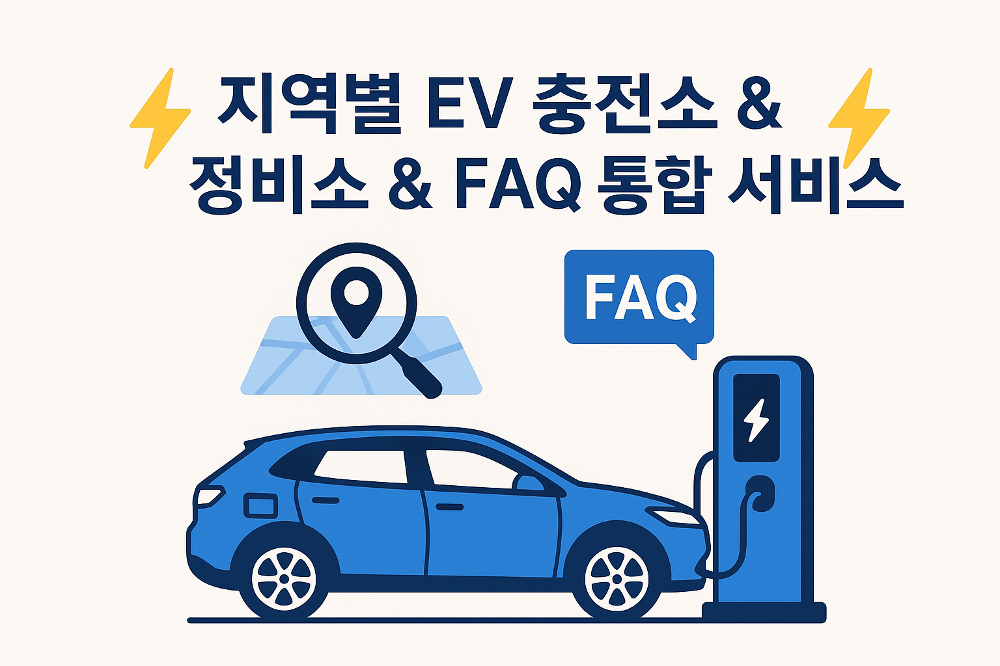
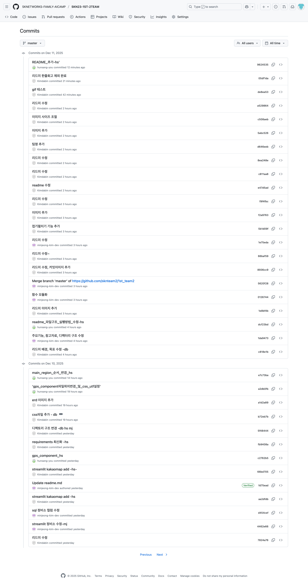
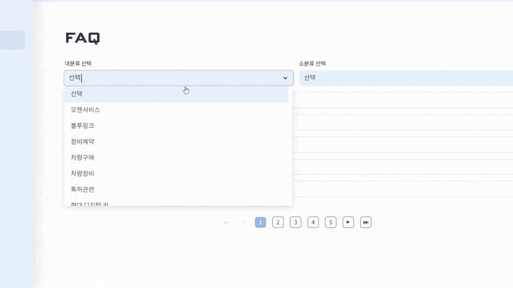
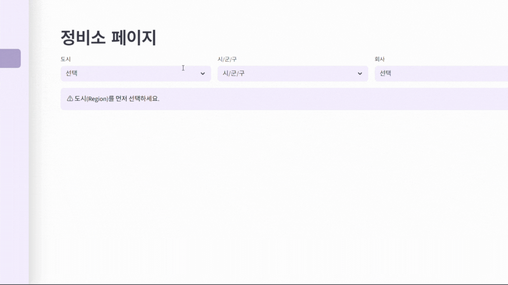

# 이브이팀


- 팀명의 의미
    - EV + 2팀 + (포켓몬 이브이)

# ⚡지역별 EV 충전소 & 정비소 & FAQ 통합 서비스⚡


## 1. 📋 프로젝트 소개

### 😊 프로젝트 팀원 및 역할

| 이름       | 역할                                       | Git                                                 |
|:-------- |:---------------------------------------- |:--------------------------------------------------- |
| 유헌상 (팀장) | 데이터 총괄 및 streamlit 메인페이지 구현              | [Git](#none)                                        |
| 김다빈 (팀원) | 현대 faq, 웹사이트 크롤링 담당, streamlit faq페이지 구현 | [Git](https://github.com/tree0327?tab=repositories) |
| 김민정 (팀원) | Mysql 데이터 정제 및 streamlit 정비소 페이지 구현, 파이썬 데이터연동 모듈화      | [Git](https://github.com/skn23-kmj)                 |

## 📅 프로젝트 기간

```
2025.12.10(수) ~ 2025.12.11(목)
```

## 2. 🎯프로젝트 개요 및 소개

### ✔️ 배경
<details>
    <summary>펼치기 / 접기</summary>
    <ul>
        <li>영국: 2035년부터 내연기관 신차 판매 전면 금지 발표  </li>
        <li>프랑스: 파리 시내에서는 이미 디젤 차량의 중심가 진입을 제한하는 저배출구역 운영</li>
        <li>독일: 베를린·뮌헨 등 대도시에서 환경등급 스티커 없는 차량은 도심 진입 불가</li>
        <li>네덜란드: 2025년부터 암스테르담 중심부에서 휘발유·디젤 차량 단계적 퇴출 진행</li>
        <li>노르웨이: 세계 최초로 2025년 내연기관 신차 판매 금지 목표를 선언한 국가</li>
        <li>미국 캘리포니아: 2035년 가솔린 신차 판매 금지 정책을 법제화</li>
        <li>중국: NEV(신에너지차) 의무 판매 비율을 지속 상향하며 EV 보급 가속화</li>
    <br>
        보시다시피 세계적으로 내연기관 차량 운행 제한이 확대됨에 따라, 전기차 보급은 급격히 증가하고 있으며 충전 인프라 및 인증 정비 서비스에 대한 수요 역시 폭발적으로 늘어나고 있습니다.
    <br>
        현재 국내에서도 전기차 생산과 판매를 폭발적으로 늘리고 있지만 다음과 같은 문제점이 여전히 존재합니다.
    <br><br>
    <ul>
        <li>생활권 내 정확한 충전소 위치 및 정보 부족</li>
        <li>전기차 특성상 고전압 배터리 등으로 인해 일반 정비소 대신 제조사 인증 EV 정비소 정보가 필수적</li>
        <li>실사용자가 원하는 지역 기반 정보가 단일 채널로 통합되어 있지 않음</li>
    </ul>
    <br>
    본 프로젝트는 이러한 분석을 바탕으로, EV 사용자들이 실시간·지역기반 충전소/정비소 정보를 한 번에 조회할 수 있도록 지원하기 위해 기획되었습니다.
</details>

### ✔️ 목표
<details>
    <summary>펼치기 / 접기</summary>
    본 프로젝트는 전기차 운전자와 예비 구매자를 위한 <strong>통합 EV 정보 플랫폼</strong>을 구축하는 것을 목표로 하며, 다음의 세부 목표를 기반으로 설계되었습니다.<br>
    <ol>
        <li>
            <h4>EV 사용자 중심의 통합 데이터 허브 제공</h4>
            <ul>
                <li>2025년 1월부터 11월까지 현대자동차와 기아(현대기아)의 내수시장 누적 판매량 합계는 약 115만 1,577대이며, 국내 완성차 5사 기준 90% 이상의 압도적인 점유율 기록하고 있습니다.</li>
                <li>현대기아의 전국 충전소·정비소 데이터를 하나의 플랫폼에 모아 사용자가 필요한 모든 정보를 **한 번에, 한곳에서** 조회할 수 있도록 합니다.</li>
            </ul>
        </li>
        <li>
            <h4>정확한 지역 기반 탐색 기능 구현</h4>
            <ul>
                <li>시/도 → 시/군/구 필터링과 주소 기반 검색, 카카오맵과 연동기능, 네이버 길찾기 기능등을 결합하여 사용자의 실제 생활 반경을 기준으로 <strong>가장 가까운 충전소와 정비소를 정확하게 탐색하고, 필요시 해당 장소까지 안전하게 이동할 수 있도록 안내</strong>합니다.</li>
            </ul>
        </li>
        <li>
            <h4>크롤링 기반 제조사별 서비스 정보 통합</h4>
            <ul>
                <li>국내시장의 90% 이상을 점유하고있는 현대의 FAQ를 탑재하여 원스톱으로 서비스를 확인할 수 있도록 합니다.</li>
            <ul>
        </li>
    </ol>
</details>

### ✨ 주요 기능 및 특징

**1) EV 충전소 통합 검색:** 

* 시/도를 선택 후 시/군/구를 선택할 수 있음
* 주소, 충전소명을 검색할 수 있음
* 카카오맵을 통한 위치기반 길찾기 가능

**2) 정비소 검색:**

* 시/도를 선택 후 시/군/구를 선택할 수 있음
* 브랜드의 선택으로 검색 가능
* 존재하지 않는 장소의 경우 안내메시지 제공

**3) FAQ 제공:**

* Selenium 기반 브랜드 공식 FAQ 자동 크롤링
* 대/소분류를 통해 자세한 검색 가능

### ✨ 참고자료

**🔗[FAQ](https://www.hyundai.com/kr/ko/faq.html)**

**🔗[전기차 차종/용도별 차량 등록 대수](https://www.data.go.kr/data/15142951/fileData.do)**

**🔗[충전소 위치 및 현황 정보](https://www.data.go.kr/data/15039545/fileData.do)**

**🔗[지역별 전기차 현황정보](https://www.data.go.kr/data/15039554/fileData.do)**

## 3. 🛠️ Tech Stack


🔧 Backend : 
`Python(3.13.5)`
`Pandas(2.3.3)`
`Selenium(4.39.0)`
<br>
`Data`
`MySQL(0.0.3)`
`DBeaver(25.3.0)`

🎨 Frontend : 
`Streamlit(1.50.0)`
`SessionState`
`CSS`

🧰 Tools : 
`Co-Work Tools`
`Git / GitHub`
`Notion`
`Discord`

### ✨ 버전관리
<details>
    <summary>펼치기 / 접기</summary>
    
</details>

## 4. 📈 데이터베이스(ERD)

 

```
🛢️sknteam2
    └── table    
        ├── city                  # 주소의 시/군/구 내역만 분리한 data
        ├── ev_regional_status    # 지역별 전기차 현황정보 data
        ├── ev_station            # 충전소 위치 및 현황정보 data
        ├── ev_vehicle_stats      # 전기차 차종/용도별 차량 등록대수 data
        ├── faq_data              # FAQ data
        ├── region                # 주소의 시/도 내역만 분리한 data
        └── repair_shop           # 정비소 data
```

## 5. 📂 디렉토리 구조

```
📁skteam2
└── 📁1st_team2
    ├── 📁images
    │   ├── commit.png             # 깃 커밋목록 이미지
    │   ├── erd.png                # erd 이미지
    │   ├── main_img.png           # 리드미 상단 메인 이미지
    │   └── stack.png.             # 기술스택 이미지
    └── 📁project
        ├── 📁api
        │   ├── __init__.py
        │   ├── car_typy.py         # 전기차 차종/용도별 차량 등록대수
        │   ├── station.py          # 충전소 위치 및 현황정보
        │   └── total_car.py        # 지역별 전기차 현황정보
        ├── 📁crawling
        │   ├── bluehands.py        # 현대 블루핸즈 크롤링
        │   ├── chromedriver.exe    # 크롬드라이버
        │   ├── faq_crawling.py     # 현대자동차 FAQ 크롤링
        │   ├── faq_data.sql        # FAQ 데이터정제 스크립트
        │   ├── kiaautoq.py         # 기아오토큐 서비스센터 크롤링
        │   └── tesla.py            # 테슬라 서비스센터 크롤링
        ├── 📁pages
        │   ├── faq.py               # streamlit FAQ 페이지               
        │   └── repair.py            # streamlit repair 페이지
        ├── 📁styles
        │   ├── faq.css              # FAQ페이지 css 스타일               
        │   ├── main.css             # main페이지 css 스타일
        │   └── repair.css           # repair페이지 css 스타일
        ├── 📁utils
        │   ├── __init__.py
        │   ├── connector_sql.py      # sql연결 모듈
        │   ├── insert_cartype.py     # 전기차 차종/용도별 
        │   ├── insert_stations.py    # 충전소 위치 및 현황 정보 데이터 삽입 
        │   ├── insert_totalcar.py    # 지역별 전기차 현황 데이터 삽입 
        │   └── load_css.py           # 페이지별 css 로드 함수 
        │
        │── gps_component.py          # 현재위치 저장 힘수
        ├── __init__.py               
        └── main.py                   # streamlit main 페이지
```

## 6. 🚀 실행 방법

1. 파이썬 3.13버전 설치([Download Python | Python.org](https://www.python.org/downloads/))

2. (가상환경 설치) python -m venv [venv명]

3. (가상환경 접속) [venv명]\Scripts\activate

4. (라이브러리 설치) pip install -r requirements.txt

5. (실행) streamlit run main.py

## 7. 🖥️ 결과 화면




## 8. 🔄 향후 개선 사항

- FAQ CRUD 기능 추가
  - 사용자들이 자주 묻는 질문을 직접 등록·수정·삭제할 수 있도록 기능 확장
- 사용자 로그인/회원관리 기능
  - 개인화된 서비스 제공을 위한 기본 인증 시스템 구축
- 반응형 UI 적용
  - 모바일/태블릿에서도 최적화된 화면 제공
- 관리자 페이지 구축
  - 충전소·정비소·FAQ 등 전체 데이터 관리 기능 제공
- API 기반 실시간 충전소 정보 연동
  - 실제 충전 가능 여부 및 상태를 실시간으로 표시
- 정비소 위치 연동 및 지도 표시 기능 강화
  - 위치 기반 필터링 및 UX 향상
- 추가 브랜드/타사 크롤링 데이터 확대
  - 더 다양한 정비소·충전소 데이터 확보
- 카카오맵 마커 고도화
  - 충전소/정비소 종류별 아이콘 및 마커 UI 개선

## 💬 한줄 회고

- 유헌상
  - 이번 프로젝트를 통해 팀장으로써 팀원분들이 가진 능력을 최대한으로 이끌어낼 수 있는 리더십이 중요하다는 것과 크롤링과 api를 통해서 가져온 데이터들을 어떻게 나누고 연결해서 사용하는지에 따라서 프로젝트 개발물의 퀄리티가 하늘과 땅차이로도 달라질 수 있다는 것을 배웠습니다.
- 김다빈
  - 팀에서 제가 크롤링을 담당했는데 실력적으로 충분하지 못해서 팀원들에게 많은 데이터를 제공하지 못한 부분은 프로젝트가 마무리되는 이 시점에서도 아쉬움이 남는 것 같습니다. 이로인해 데이터를 모으는작업이 잘 선행되어야 이후 개발을 수월하게 설계하고 또 구현할 수 있다는걸 깨달았습니다. 또한 크롤링한 데이터를 MYsql로 정제하는 과정, 이후에 connector를 이용하여 python과 MYsql을 연동해서 데이터를 뽑아오고 Streamlit을 이용하여 ui로 구현됐을 때 정말 기분좋았던 것 같습니다. 이번 프로젝트는 데이터를 기반으로 한 서비스개발의 전체 흐름을 경험하며 확실히 성장할 수 있었던 기회였습니다.
- 김민정
  - 팀 프로젝트도 개발도 모두 처음이라 어디서부터 시작해야 할지 막막했지만, 팀원들의 많은 도움 덕분에 끝까지 완주할 수 있었습니다. 과정 중에는 실수도 많았고 오류도 자주 발생해 해결하는 데 어려움도 있었지만, 모두 해결하고 뿌듯함을 느꼈습니다. 아직 부족한 점이 많지만, 이번 경험을 통해 실무에 한 걸음 더 가까워진 느낌이 들어 좋은 경험이었던 것 같습니다.